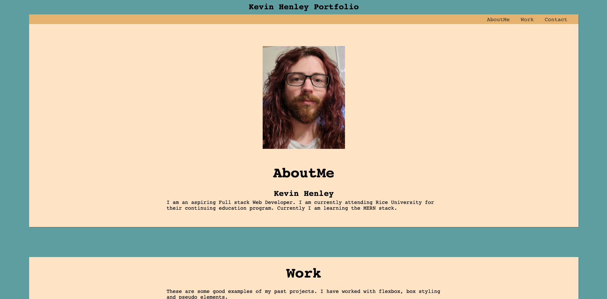

# homework_week_2

## Ojective
* The point of this project was to create a portfolio site using html and css

 

## Requirements
* The site must contain a nav bar with links that go to AboutMe, Work and Contact
* It must have a recent photo
* It needs to have the projects that I have done with titles and links that go to their page
* There must be an area that gives out contact information

 

## Screenshot

 

## Link
[Website](https://kevinhenleycode.github.io/homework_week_2/)