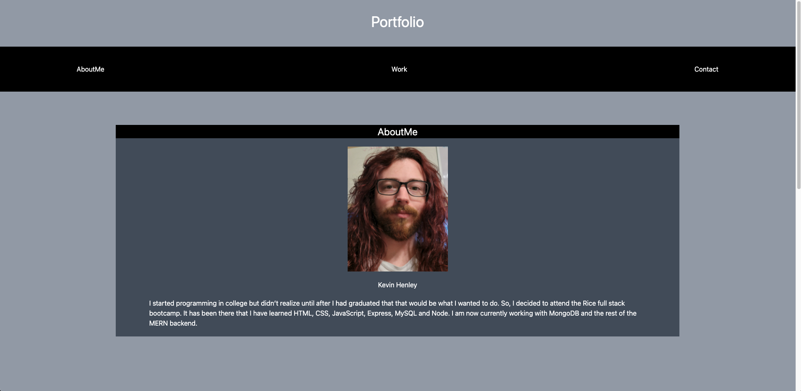

# Portfolio

## Ojective
* To create a potfolio site that displays the work that I have accomplished since I have started classes.

 

## Requirements
* Contain at least 2 projects that I am most proud of.
* Have links to each site and thier GitHub repos, along with a screenshot of each one.
* The portfolio site must be mobile responsive.
* It needs links to my Email, GitHub and LinkedIn.
* Have a downloadable PDF of my resume.

 

## Screenshot

 

## Link
[Website](https://kevinhenleycode.github.io/Portfolio/)